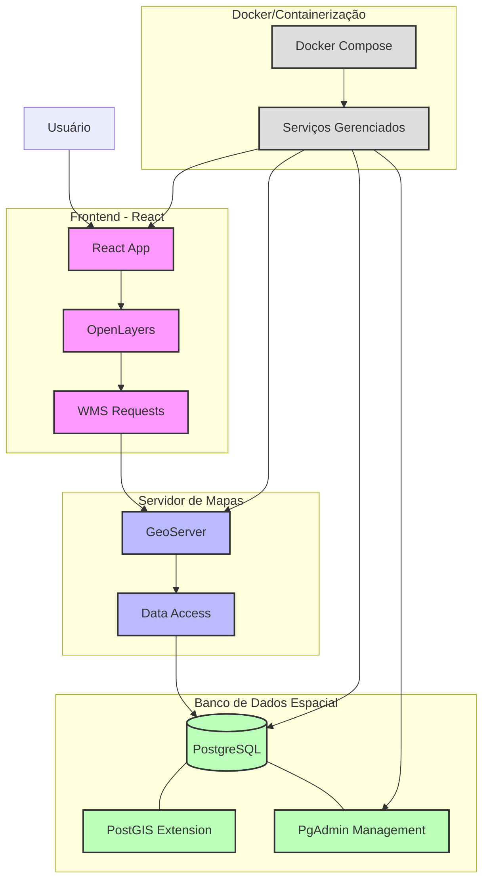
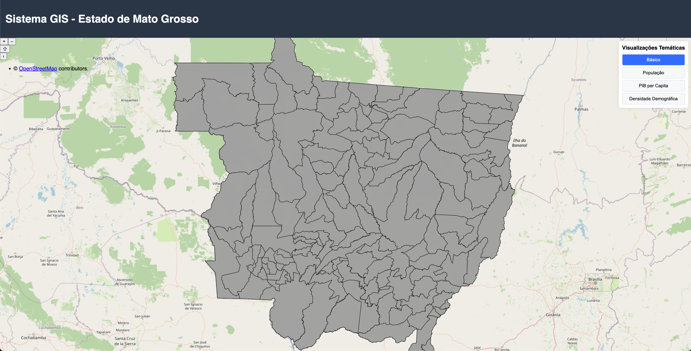
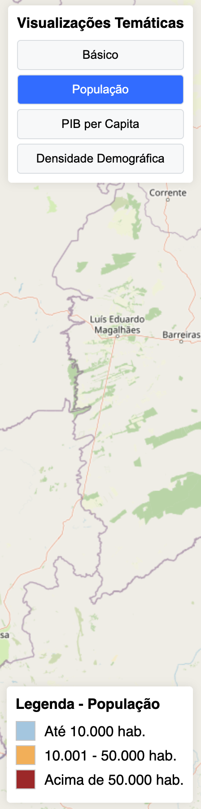
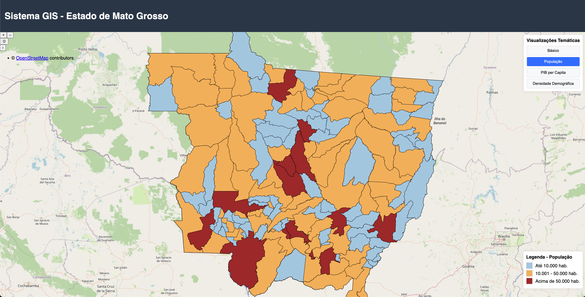

# GIS App

## Descrição da Aplicação

O GIS App é uma aplicação web geoespacial que permite visualizar e interagir com dados geográficos do estado do Mato Grosso. A aplicação combina um frontend React moderno com serviços GIS robustos para fornecer uma interface intuitiva para análise e visualização de dados espaciais. Esta solução resolve o problema de acesso e manipulação de informações geográficas complexas, tornando-as acessíveis através de uma interface web amigável.

## Arquitetura Proposta

A aplicação segue uma arquitetura de microserviços containerizada, composta por:

### Componentes principais

- **Frontend**: Aplicação React com TypeScript que fornece a interface de usuário e visualização de mapas
- **GeoServer**: Servidor de mapas que gerencia e serve dados geoespaciais via WMS
- **PostgreSQL/PostGIS**: Banco de dados espacial para armazenamento de dados geográficos
- **PgAdmin**: Interface web para gerenciamento do banco de dados PostgreSQL

### Fluxo de dados

1. Os dados geográficos são armazenados no PostgreSQL com a extensão PostGIS
2. O GeoServer acessa os dados do PostGIS e os expõe como serviços web (WMS)
3. O frontend React consome esses serviços via biblioteca OpenLayers (ol)
4. O usuário interage com os mapas e dados através da interface web

### Tecnologias utilizadas

- **Frontend**: React 19, TypeScript, Vite, Material UI, OpenLayers
- **Backend**: GeoServer 2.27.0
- **Banco de dados**: PostgreSQL 16 com PostGIS 3.4
- **Containerização**: Docker e Docker Compose
- **Gestão de BD**: PgAdmin 4

### Diagrama da arquitetura



O diagrama acima ilustra como os diferentes componentes da aplicação se comunicam e trabalham juntos. Os usuários interagem com o frontend React, que utiliza OpenLayers para renderizar mapas e fazer solicitações WMS ao GeoServer. O GeoServer acessa os dados espaciais armazenados no PostgreSQL com extensão PostGIS. Todo o ambiente é containerizado usando Docker Compose, facilitando a implantação e escalabilidade do sistema.

## Instruções de Instalação e Execução

### Pré-requisitos

- Docker e Docker Compose instalados
- Git instalado

### Passos para execução

1. Clone o repositório

```bash
git clone https://github.com/joaooliveira10/gis-app.git
cd gis-app
```

2. Inicie os containers

```bash
docker-compose up -d
```

3. Verifique se todos os serviços estão em execução

```bash
docker-compose ps
```

4. Acesse os serviços através dos seguintes endereços:
   - Frontend: http://localhost:3000
   - GeoServer: http://localhost:8085/geoserver
   - PgAdmin: http://localhost:8080

### Configuração Inicial

#### Configurando o PostgreSQL via PgAdmin

1. Acesse http://localhost:8080
2. Faça login com as credenciais:
   - Email: admin@admin.com
   - Senha: admin
3. Adicione um novo servidor com as seguintes configurações:
   - Nome: GIS Database
   - Host: postgres
   - Porta: 5432
   - Banco de dados: postgres
   - Usuário: postgres
   - Senha: postgres

#### Configurando camadas no GeoServer

1. Acesse http://localhost:8085/geoserver
2. Faça login com as credenciais padrão (admin/geoserver)
3. Adicione um novo armazenamento de dados apontando para o PostgreSQL
4. Publique as camadas desejadas seguindo o assistente de configuração

## Exemplos da Aplicação

### Tela Inicial


_Visualização da interface principal com mapa do Mato Grosso_

### Seleção de Camadas


_Painel lateral para ativação e desativação de camadas_

### Análise Espacial


_Exemplo de análise de uso do solo com sobreposição de camadas_

## Solução de Problemas

Se encontrar algum problema durante a instalação ou execução, verifique:

1. Se todas as portas necessárias estão disponíveis (3000, 8080, 5432, 5050)
2. Os logs dos containers com `docker-compose logs [serviço]`
3. Se o volume de dados está montado corretamente

Para mais informações, consulte a documentação detalhada na pasta `/docs`.
